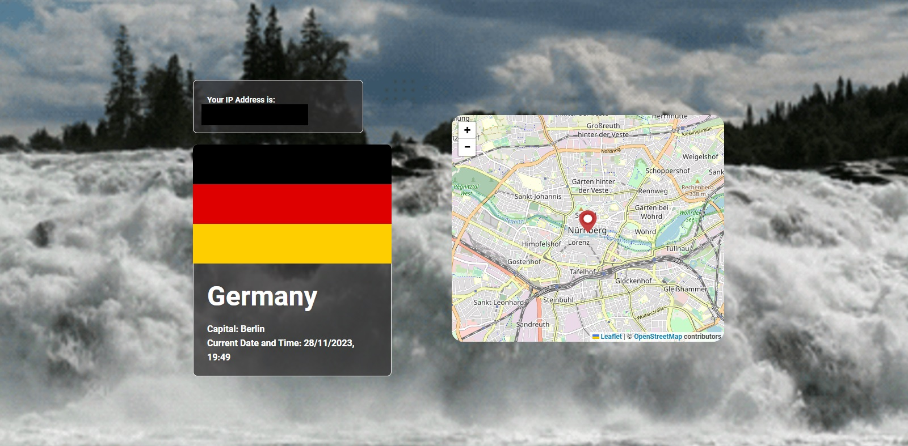
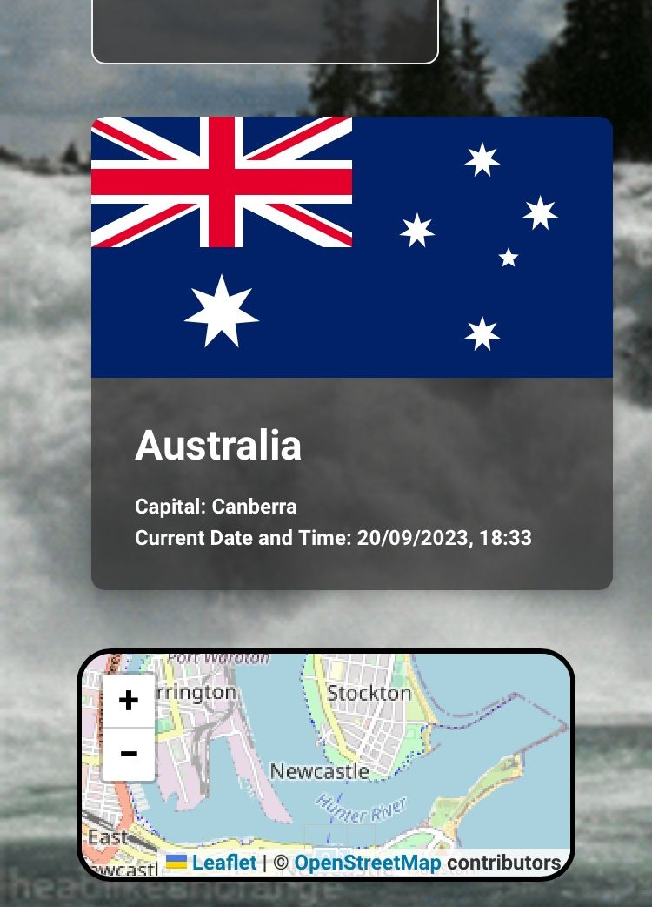
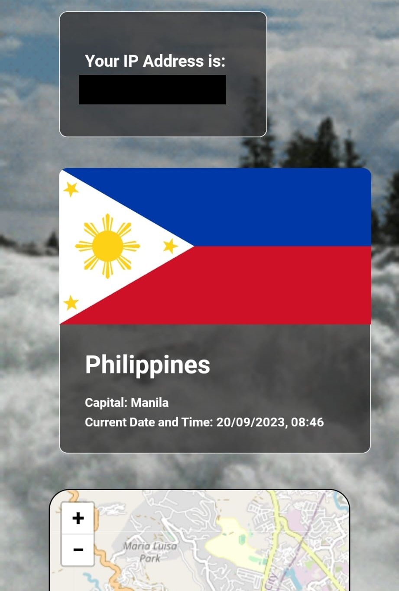
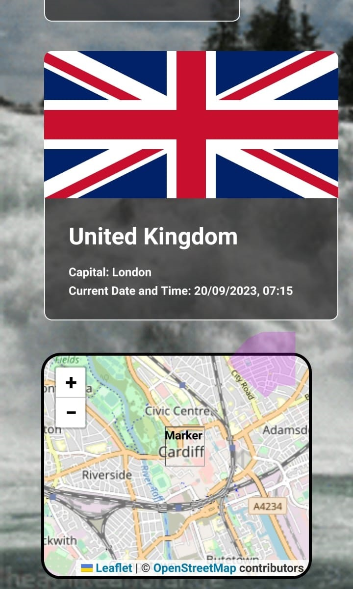

# IP Project

Here I am using two APIs to fetch the user's IP address and location, and am returning the home country, its flag and capital. 

I used TypeScript with mostly Tailwind CSS.

See Below for screenshots:

**Germany (Desktop)**
<!--  -->

**Australia (Mobile)**
<!--  -->

**Singapore (Mobile)**
<!--  -->

**UK (Mobile)**
<!--  -->

